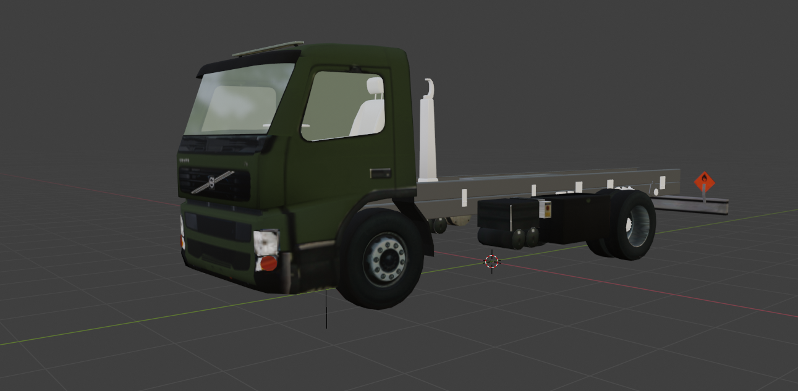

**********
Flightgear Volvo-FM
**********

Truck prototype for various experimental purposes in Flightgear.
Originally made by: M.Kraus / The lake of constance hangar.

----

Target Milestones:
##################

- Assemble bare minimum chassie, "frame, wheels, rear-axle" for first physics experiments.
- Investigate possibility to drive vehicle on wheels instead of propulsion system working in air.
- Include rear axle leaf springs, and create animations for said assembly.
- Include hooklift & put in to some sort of working order.
- Move on to try handle "Cargo".
- Etc.

To Knowledge:
#######

The purpose of this project is not to be visually correct.
But rather to give a introduction in to utilizing various solutions in Flightgear.
